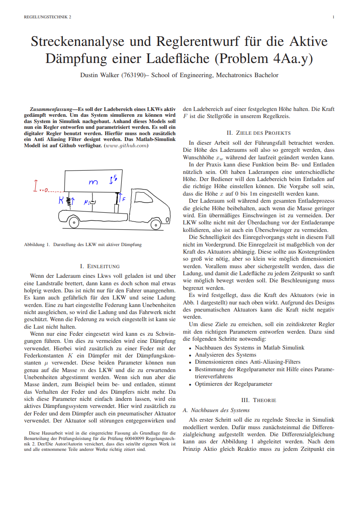

# Aktive Dämpfung einer LKW Ladefläche

Dieses Repository ist im Rahmen der Vorlesung Regelungstechnik 2 (Professor Notholt) der Hochschule Reutlingen entstanden.
Diese Arbeit bildete die Grundlage für die Endnote für die Vorlesung.

Es soll der Ladebereich eines LKWs aktiv
gedämpft werden. Um das System simulieren zu können wird
das System in Simulink nachgebaut. Anhand dieses Models soll
nun ein Regler entworfen und parametrisiert werden. Es soll ein
digitaler Regler benutzt werden. Hierfür muss zusätzlich
ein Anti Aliasing Filter designt werden.

Dieses Projekt war eines der besten des Semesters. Vorallem der Der Abschnitt V.C Wandernder Arbeitspunkt ist sehr interessant.

Lesen Sie die [Dokumentation](Regelungstechnik2_Projekt_Mechanische_Translation.pdf).

### Preview:

